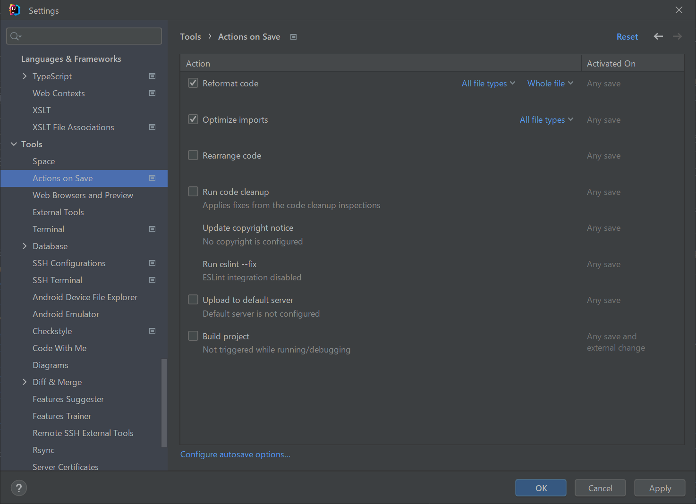

# bff

Backend For Frontend(BFF) -> SpringBoot + TiDB(MySQL 5.6/5.7互換) + Redis + SQS

## 概要

* ユーザに画面を提供するSpringBootのサンプルapplicationである。
* ログイン跡、TODOの取得、登録、完了、削除を行える画面を提供する。
* TODOの操作は別途作成されたTODOを管理するBackendアプリケーションのRest APIを利用している。
* ユーザはDBで管理されており、ユーザのCRUDを操作する画面も提供する。

<br>
TODO：アプリのイメージ

## 画面一覧

* 作成している画面は以下の通り。

| 画面名 | 説明 | 画面イメージ |
| ---- | ---- | ---- |
| ログイン画面 | トップページの画面で、ユーザがログインするための画面。 | [画面](img/screen/screen1.png) |
| メニュー画面 | メニュー画面。ログインユーザのロールによって管理者メニューの表示有無が切り替わる。 |  [画面](img/screen/screen2.png) |
| Todo管理画面 | Todoリストの一覧表示、登録、完了、削除といった操作を実施できる画面。 | [画面](img/screen/screen3.png) |
| ユーザ一覧画面 | 登録されているユーザを一覧表示する画面。 | [画面](img/screen/screen4.png) |
| ユーザ登録画面 | ユーザを新規登録するための画面。 | [画面](img/screen/screen5.png) |
| ユーザ詳細画面 | ユーザの詳細情報の表示と情報更新するための画面。 | [画面](img/screen/screen6.png) |

## 画面遷移図

* TODO：画面のイメージ

# 事前準備

* 以下のライブラリを用いているので、EclipseのようなIDEを利用する場合には、プラグインのインストールが必要
    * [Lombok](https://projectlombok.org/)
        * [Eclipseへのプラグインインストール](https://projectlombok.org/setup/eclipse)
        * [IntelliJへのプラグインインストール（最新バージョンでは対応不要）](https://projectlombok.org/setup/intellij)
    * [Mapstruct](https://mapstruct.org/)
        * [EclipseやIntelliJへのプラグインインストール](https://mapstruct.org/documentation/ide-support/)
        * [Gradleへのライブラリ追加方法等](https://tech.excite.co.jp/entry/2021/04/08/234535)
    * [フォーマッター（Google Java Style Guide）](https://google.github.io/styleguide/javaguide.html)
        * [利用ファイル（intellij-java-google-style.xml）](https://github.com/google/styleguide/blob/gh-pages/intellij-java-google-style.xml)
        * [Google Java Style Guideの非公式和訳](https://kazurof.github.io/GoogleJavaStyle-ja/)
    * [Checkstyle](https://checkstyle.sourceforge.io/)
        * [IntelliJへのプラグインインストール方法](https://nainaistar.hatenablog.com/entry/2021/02/01/120000)
        * TODO：Gradleに組み込みたい！

* TiDBは無料トライアルを利用
    * ローカル環境でTiDBを利用できるようなので後で試してみる！
        * https://docs.pingcap.com/ja/tidb/stable/quick-start-with-tidb#simulate-production-deployment-on-a-single-machine
        * https://github.com/pingcap/tidb-docker-compose

* IntelliJで開発するときの設定メモ(TODO：日々メンテナンス)
    * ファイル保存時のアクション
      
        * Reformat code：変更が加えられたコードのみにフォーマットする
        * Optimize Imports：インポート宣言を最適化
        *

* 開発状況
    * ログイン画面開発中！
* 開発メモ
    * ログはJSON形式で
    *

## Dockerでのアプリ起動

* Gradleビルド
  * IDEまたはコンソールからビルドを実施してください

* Dockerfileのビルド  
  `-t`:イメージ名の指定

```sh
docker build -t webapi .
```

* イメージの実行  
  `-d`:デタッチドモードでコンテナ起動。付与しないとしバックグラウンドで実行されない。  
  `-p`:入力ポートの指定。ホスト側ポート:コンテナ側ポート  
  `--name`:コンテナの名前を指定。

```sh
docker run -d -p 80:80 --name webapi webapi
```

* ヘルスチェックのパスにアクセスして起動を確認する
  <http://localhost/actuator/health>

## ECRにpush(タグ名にGitのコミットIDを利用した、shellによる一発push)

* docker/ecr_push-example.shの"xxxxxxxxxxx"部分を置換して、ecr_push.shファイルを作成する

* shell実行

```sh
bash ecr_push.sh
```

## ECRにpush(参考までに)

* Dockerfileのビルド

```sh
docker run -d -p 80:80 webapi
```

* ビルドしたイメージにタグ付け

```sh
docker tag webapi:latest xxxxxxxxxxx.dkr.ecr.ap-northeast-1.amazonaws.com/webapi:latest
```

* ECRにログイン

```sh
aws ecr get-login-password --region ap-northeast-1 | docker login --username AWS --password-stdin xxxxxxxxxxx.dkr.ecr.ap-northeast-1.amazonaws.com
```

* ECRにpush

```sh
docker push xxxxxxxxxxx.dkr.ecr.ap-northeast-1.amazonaws.com/webapi:latest
```
